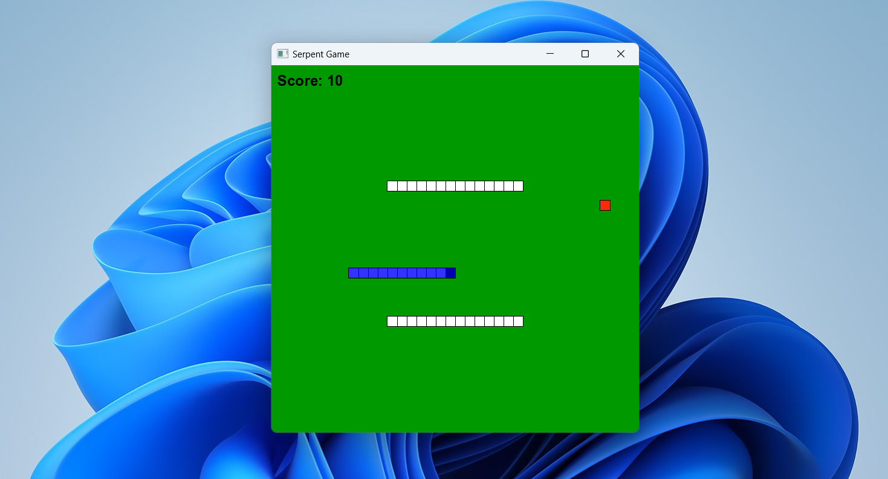

## Snake Game: Simple Documentation and Learning Points

This code implements a basic **Snake Game** using C++ and the **SFML (Simple and Fast Multimedia Library)**. In this game, the player controls a snake that moves around a grid, aiming to eat "fruit" while avoiding collisions with itself or the game boundaries. Every time the snake eats a fruit, it grows longer, and the player's score increases.

## Structure

- **main.cpp**: Contains the core source code for the game, including the game loop, rendering logic, and gameplay mechanics.
- **sfml-xxxx.dll**, **libxxxx.dll**, **openal32.dll**, **Makefile.win**, **Arial.ttf**: Contains configuration files for setting up the game environment. These files are solely for configuring SFML and do not include core game logic.

## Concepts Learned

1. **Basic SFML for Game Development**
2. **C++ Object-Oriented Programming (OOP)**
3. **Game Mechanics**
4. **Basic UI and Graphics**